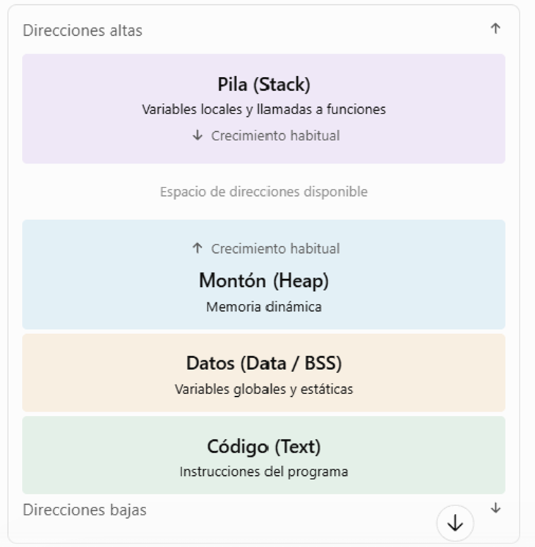
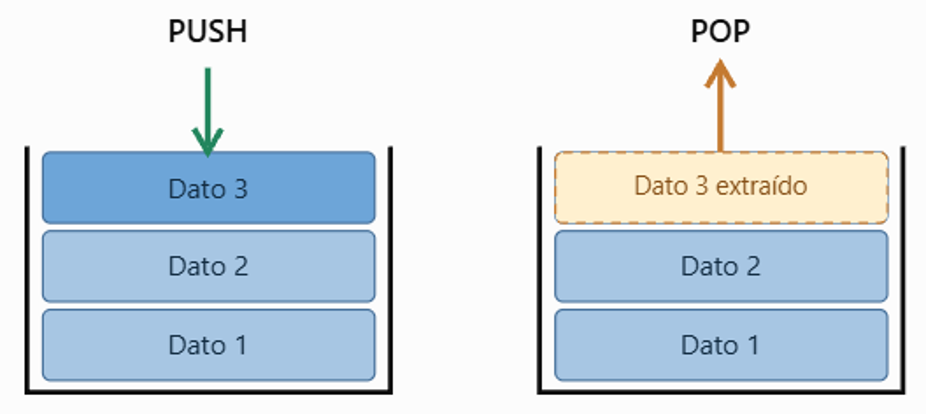

# UT2.2 Funcionamiento elementos CPU

## Instrucciones

```note
Se denomina **instrucción**  al conjunto de datos insertados en un programa de ordenador y que el procesador interpreta y ejecuta.
```

Las instrucciones del computador son las que determinan el funcionamiento de la CPU que las ejecuta.

Los tipos de instrucción permitidos están definidos y determinados dentro de cada plataforma en lo que se **llama** el **conjunto o juego de instrucciones** (*ISA Instruction Set Architecture*).

Las instrucciones a su vez tienen un **formato concreto** (según establece su diseño del juego de instrucciones), que divide cada instrucción de *n bits* (*normalmente 32 o 64*) en **varios campos**.

Para determinar el tipo de instrucción usaremos su *Opcode*.


En todas las CPU modernas se pueden encontrar el siguiente **conjunto de instrucciones**:

-   Instrucciones de transferencia de datos *(mem-cpu)*
-   Instrucciones aritméticas
-   Instrucciones lógicas
-   Instrucciones de control
-   Instrucciones de transferencia Entrada/Salida


Cada instrucción se suele identificar con un **nemotécnico** que hace referencia a la función que realiza la instrucción *(MOVE, STORE, LOAD, ADD, MULTIPLY, SET, INCREMENT...)*

-   Ejemplos de instrucciones de **transferencia** de datos del modelo x86:

    - MOVE: transfiere datos entre registros de la CPU.
    - STORE: transfiere datos de registro → memoria.
    - LOAD: transfiere datos de memoria → registro.
    - CLEAR: pone un registro en ceros.
    - SET: pone un registro en unos.
    
-   Ejemplos de instrucciones **aritméticas** de datos del modelo x86:

    - ADD: suma dos operandos.
    - SUBSTRACT: resta dos operandos.
    - MULTIPLY: multiplica dos operandos.
    - DIVIDE: divide dos operandos.
    - ABSOLUTE: calcula el valor absoluto del operando.

-   Ejemplos de instrucciones **lógicas** de datos del modelo x86:

    - AND: Y lógico bit a bit.
    - OR: O lógico bit a bit.
    - NOT: NO lógico bit a bit.
    - XOR: O exclusivo lógico bit a bit.
 
-   Ejemplos de instrucciones **de control** de datos del modelo x86:

    - JUMP: salto incondicional.
    - JUMP CON: salto condicional.
    - JUMP SUB: salto a subrutina.
    - RETURN: retorno de subrutina.
    - SKIP: incrementa PC en 1.
    - SKIP CON: incremento condicional de PC en 1.
    - HALT: detiene la ejecución del programa.
    - WAIT: detiene la ejecución hasta una condición.

-   Ejemplos de instrucciones **de transferencia E/S**:

    - INPUT: transfiere datos de E/S → memoria o registro.
    - OUTPUT: transfiere datos de memoria o registro → E/S.
    - START I/O: inicializa el dispositivo de E/S.
    - TEST I/O: transfiere información del estado de E/S.
    

## Fases de una instrucción

Toda instrucción residente en memoria principal pasa por una serie de fases que van desde su captura a su interpretación y ejecución. Éstas son:

1.  **Carga, búsqueda o lectura (fetch).** La UC envía a la memoria principal la dirección de la instrucción a ejecutar, que está almacenada en el registro contador de programa (PC) y activa las señales de control necesarias para que ésta le entregue la mencionada instrucción.
2.  **Decodificación (decode)**. La UC recibe la instrucción, la analiza y, en su caso, lee los operandos de la memoria principal, enviando su dirección y activando las correspondientes señales de control.
3.  **Ejecución (execution)**. La ALU, bajo las órdenes de la UC, realiza la operación sobre los operandos, y, si es necesario, se graba el resultado en la memoria principal (store) o en un registro.
4.  **Incremento del contador de programa** (PC). Con lo que se puede pasar a ejecutar la instrucción siguiente, aunque existen instrucciones que pueden modificar el contenido del PC dando lugar a ‘saltos’.

## Funcionamiento de un programa


## Funcionamiento arquitectura interna

Una vez estudiada la **arquitectura** podemos deducir que existen una serie de parámetros que sirven para determinar la **capacidad de proceso** de una CPU, que básicamente serían:

-   **Velocidad de procesador**. Determina el ritmo de ejecución de instrucciones. Se mide en hercios y múltiplos de éstos.
-   **Juego de instrucciones**. Cada tipo de CPU tiene un juego de instrucciones característico.
-   **Tamaño del bus de datos y direcciones**. Se mide en bits, siendo hoy día habitual los 64 y 128 bits de tamaño.
-   Número de registros de que dispone.
-   Líneas y señales de interrupción que implementa.

Recordar los registros de la CPU con los que vamos a trabajar vistos previamente:

-  **El Registro de Instrucciones (IR)** es un registro de propósito especial. Se utiliza para guardar la instrucción que se ha buscado desde la memoria.
-  **El Registro Contador de Programa** (PC – *Program Counter*): Se utiliza para guardar la dirección de memoria de la próxima instrucción a buscar.
-  **Registro de Direcciones de memoria** (MAR – *Memory Address Register*) se usa para guardar exclusivamente direcciones de memoria.
-  **Registro de datos** (MDR - *Memory data Register*): Almacenamiento temporal entre los datos de la memoria y la ALU.
-  **Registro Acumulador (RA)** en el que son almacenados temporalmente los resultados aritméticos y lógicos intermedios que serán tratados por el circuito operacional de la unidad aritmético-lógica (ALU).
-   **Registros de Entrada de operandos de la ALU:** Registro de entrada de operandos a la ALU.


## Pila de memoria

En la arquitectura de Von Neumann, la memoria principal (RAM) almacena tanto las **instrucciones del programa** como los **datos** que necesita para ejecutarse.

Cuando se ejecuta un programa, el sistema operativo le proporciona un espacio de memoria virtual que suele organizarse en diferentes zonas o segmentos lógicos.

| Zona de memoria | Contenido |
|---|---|
| **Código (Text)** | Instrucciones ejecutables del programa. |
| **Datos (Data/BSS)** | Variables globales y estáticas. |
| **Montón (Heap)** | Memoria reservada dinámicamente durante la ejecución. |
| **Pila (Stack)** | Información temporal asociada a las llamadas a funciones. |



### Pila (stack)

La pila (stack) es una zona de memoria utilizada para almacenar información temporal necesaria durante la ejecución de un programa, especialmente cuando se realizan llamadas a funciones o subrutinas.

Su funcionamiento sigue el principio **LIFO** (Last In, First Out): El último elemento que entra en la pila es el primero que sale.

Podemos imaginarla como una pila de platos: colocamos un plato encima de otro y, cuando necesitamos retirar uno, comenzamos por el último que hemos colocado.

Operaciones fundamentales:
- PUSH (apilar): introduce un elemento en la pila.
- POP (desapilar): extrae un elemento de la parte superior de la pila.



### El registro SP (Stack Pointer)

Para gestionar la pila, la CPU utiliza un registro especial denominado **SP** (Stack Pointer) o puntero de pila.

Este registro contiene una dirección de memoria asociada al extremo activo de la pila.

Cuando se realizan operaciones PUSH o POP, el SP se actualiza para reflejar la nueva posición.

El sentido en el que se modifica depende de la arquitectura. En muchos sistemas actuales, la pila crece hacia direcciones de memoria inferiores.

### Ejemplo

La misión de la pila es guardar información temporal durante la ejecución del programa, especialmente:

- Variables locales de funciones.
- Parámetros pasados a funciones.
- Direcciones de retorno (para saber a dónde volver tras ejecutar una subrutina).

Supongamos el siguiente pseudocódigo de un programa que suma dos números y que llama a una función llamada suma:

```java
int main() {
    int x = 5;
    int y = 7;
    int total = suma(x, y);
}


int suma(int a, int b) {
    int resultado = a + b;
    return resultado;
}

int main() {
    int x = 5;
    int y = 7;
    int total = suma(x, y);
}

```

1. Se cargará carga en memoria el programa:

- El segmento de código, con las instrucciones de main() y suma().
- El segmento de datos, con las variables globales (en este caso no hay ninguna).
- Se reserva espacio para la pila (stack).

2. Se ejecuta el main

- Se crean en la pila las variables locales x, y y total.
- El registro SP apunta al tope actual de la pila.

3. Se llama a la función suma(x,y):

- La Unidad de Control (UC) genera una instrucción de llamada (CALL) → guarda la dirección de retorno en la pila.
- Se reservan en la pila los parámetros a, b y la variable local resultado.

4. Ejecución dentro de suma():

- La UC decodifica la instrucción resultado = a + b.
- Los valores a y b se cargan desde la pila a registros internos.
- La ALU realiza la operación 5 + 7 = 12.
- El resultado se guarda en la celda de la pila correspondiente a resultado.
- Al ejecutar return resultado, la UC:
- Recupera el valor 12.
- Desapila la dirección de retorno para volver al punto en main().


